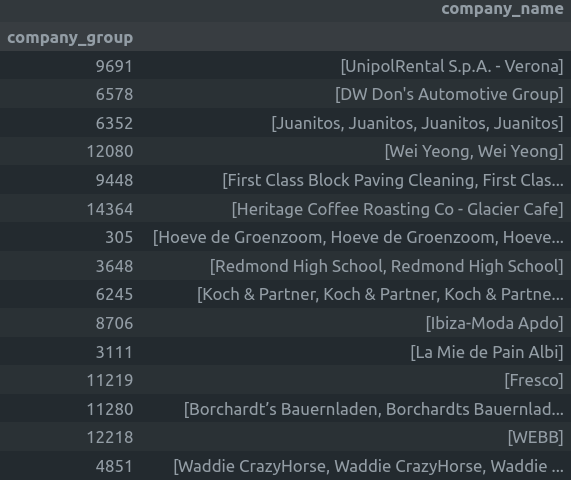

# Entity Resolution - Deeptech Engineer Challenge

## Description
This project addresses the difficulty of identifying unique organizations and grouping duplicate records from a dataset supplied from several systems.  Although the dataset includes a wealth of firm information, the main goal is to precisely identify and classify duplicate entries by utilizing the most pertinent characteristics, in this case, the company names.

## Features
- Data Loading: A Pandas DataFrame is used to process the dataset after it has been saved in a Parquet file: `veridion_entity_resolution_challenge.snappy.parquet`
- Data normalizing: A normalizing function is used to the firm names in order to lessen variations brought on by changes in capitalization and special characters.  This function eliminates all non-alphanumeric characters from names and changes them to lowercase.
- Duplicate Grouping: We calculate the similarity between normalized company names using fuzzy string matching: `rapidfuzz` package.  To determine whether two names belong to the same company, a similarity criterion of 90 is selected:
a) The record is given the same group ID if a match is discovered over the threshold.
b) A new group is formed if no match is discovered.
- Group ID mapping makes it simple to group duplicate records in the DataFrame by assigning each one a company_group ID based on the deduplication process.
- The last stage, result aggregation, groups the records according to their group IDs, making it evident which firm names have been grouped together as duplicates.

## Image

## Contact

**Email**: mariusc0023@gmail.com
